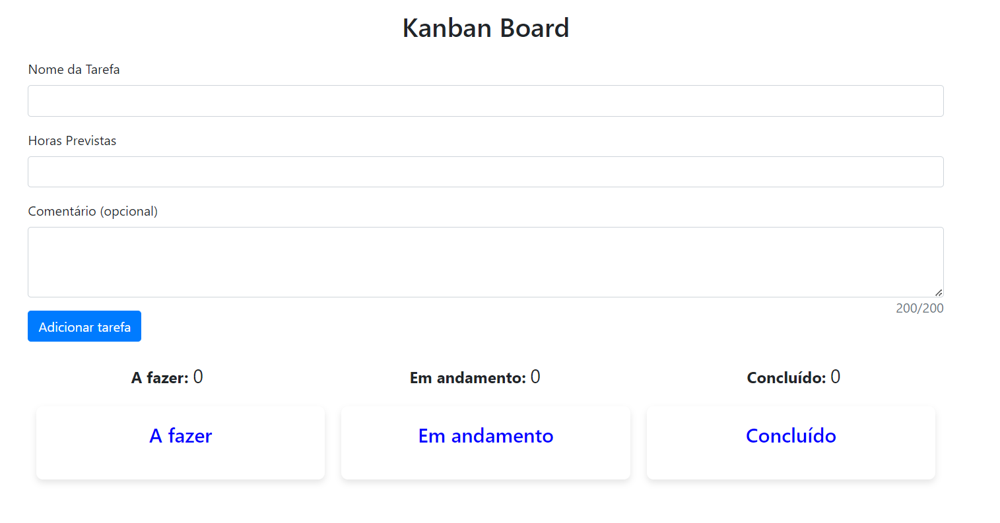

# Kanban Board

O Kanban Board é uma aplicação web simples que permite gerenciar tarefas usando o método Kanban. Você pode criar tarefas, movê-las entre as colunas "A fazer," "Em andamento," e "Concluído," editar tarefas e marcar tarefas como concluídas.

## Recursos

- Crie, edite e exclua tarefas.
- Mova tarefas entre as colunas.
- Marque tarefas como concluídas.
- Acompanhe o tempo previsto para cada tarefa.
- Adicione comentários opcionais a cada tarefa.

## Uso

1. **Adicionando Tarefas:** Preencha o nome da tarefa, horas previstas e, opcionalmente, um comentário. Clique em "Adicionar Tarefa."

2. **Editando Tarefas:** Clique no ícone de lápis para editar uma tarefa. Faça as alterações desejadas e clique em "Salvar Alterações."

3. **Excluindo Tarefas:** Clique no ícone da lixeira para excluir uma tarefa. Uma confirmação será solicitada.

4. **Movendo Tarefas:** Arraste e solte tarefas entre as colunas "A fazer," "Em andamento" e "Concluído."

5. **Marcar Tarefas:** Marque a caixa de seleção de uma tarefa para marcá-la como concluída. Ela será movida para a coluna "Concluído."

## Tecnologias Usadas

- HTML
- CSS
- JavaScript
- jQuery
- Bootstrap

## Licença

Este projeto é licenciado sob a Licença MIT. Consulte o arquivo [LICENSE](LICENSE) para obter detalhes.

---

**Aproveite o uso do Kanban Board!** 🚀

Se você tiver alguma dúvida ou precisar de assistência, sinta-se à vontade para entrar em contato.